# Poke Mystery Nature Game

This Game is Developed By Das Tarlochan Preet Singh...

# Features
- Made in Android Studio
- UI Designed in Adobe XD
- Made using Flutter Framework
- Goal of game is to answer the questions truly and the game reveals the user Nature or Personality and his Pokemon.
- Music is played on the Background
- Uses Provider to pass data between different screens
- Uses Router to open new screens
- App can be deployed and run for both Android and IOS
- The Game reveals 13 Nature or Personality of User
- The Game assigns 13 different Pokemon to User depend on Nature
- Every Question answered increases the Nature Assosiated with the option select 

# Screenshots:

<b>Splash Screen</b>
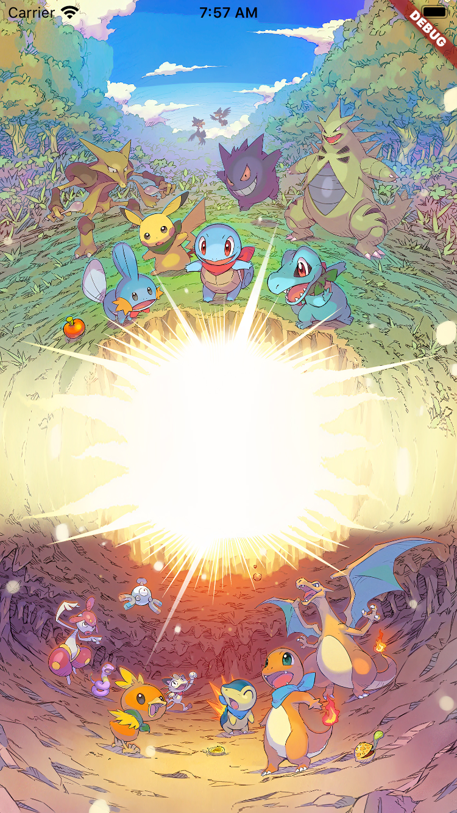 

This is Splash screen of the App it stays for 3 seconds

<b>About Screen</b>
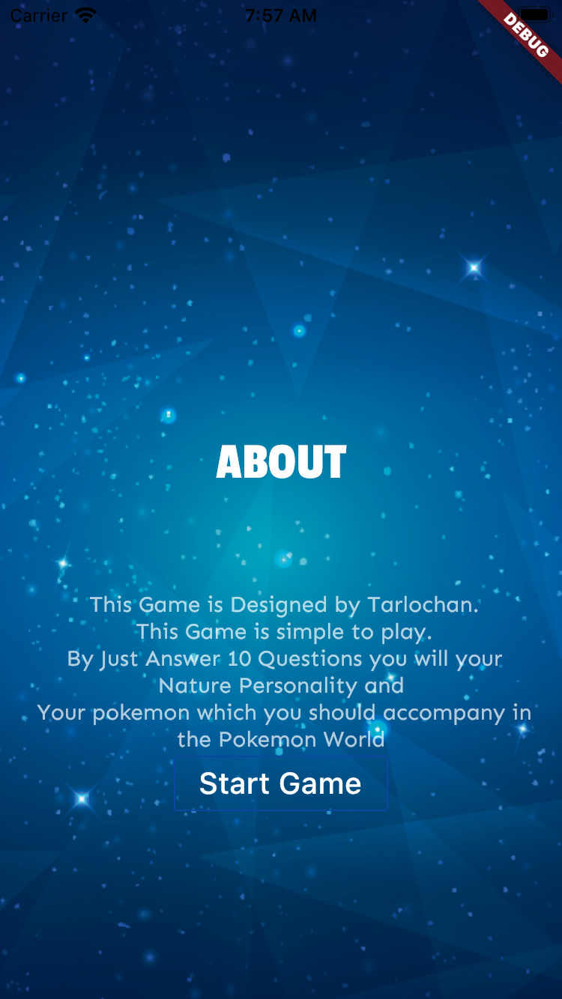 

This is About screen of the App.
 We can see instructions from the developer here  

<b>Questions Screen with 5 Options</b>
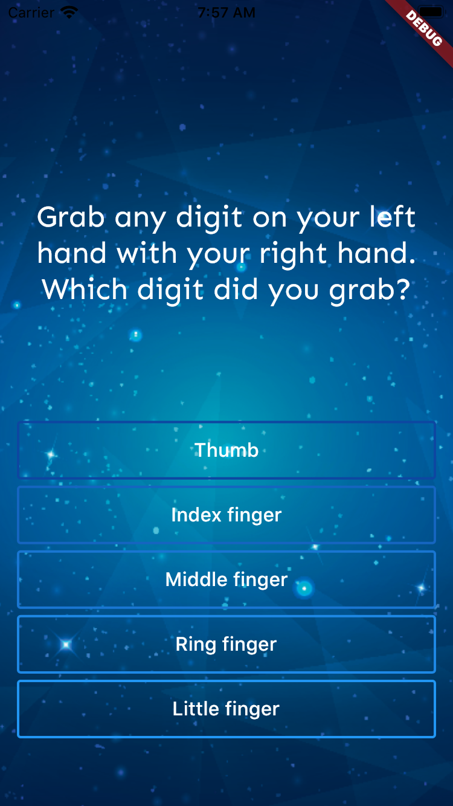 

This is Game screen of the App.
 Here a Question is displayed to user and he has options to select  

<b>Questions Screen with 4 Options</b>
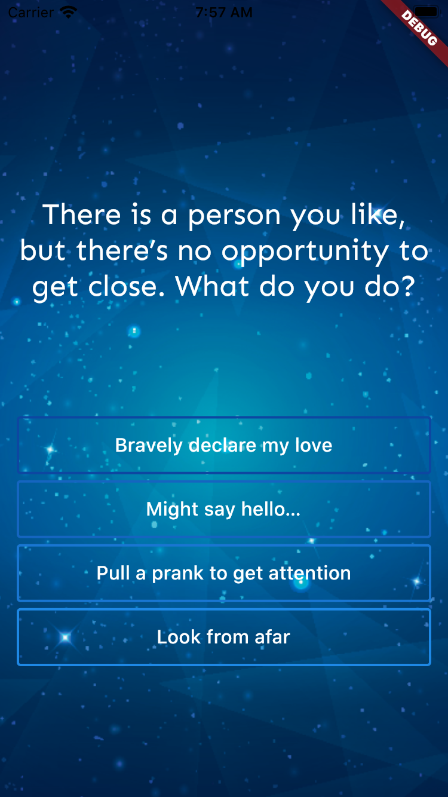 

This is Game screen of the App.
 Here a Question is displayed to user and he has options to select  

 
 
 
 

<b  align="left" >Result Screen</b>

This is Result screen of the App.
 Here after Answering the Questions and choices made by the user a pokemon and user nature personality is shown  

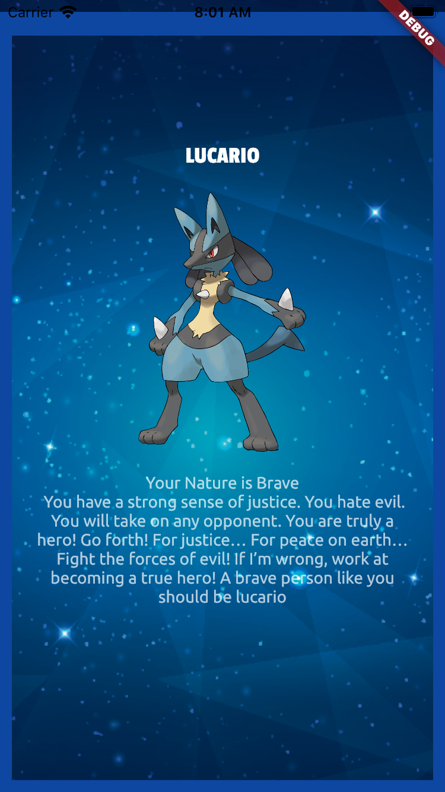
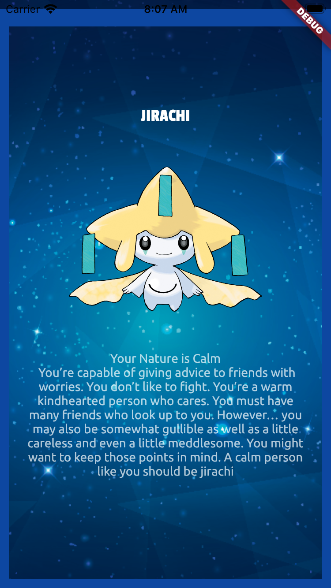
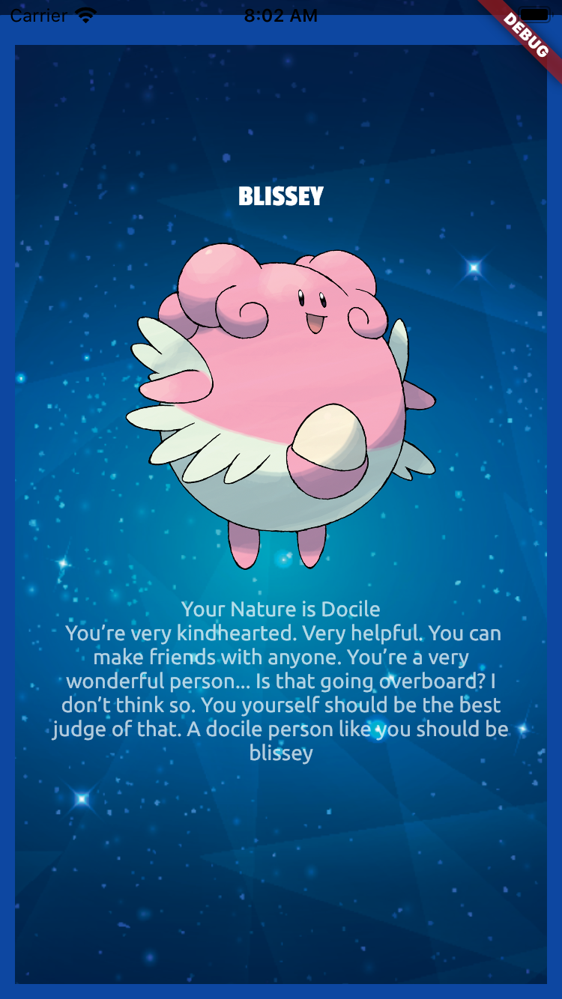
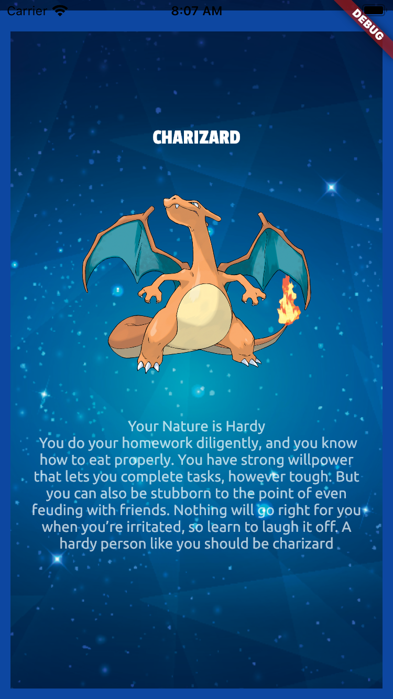  
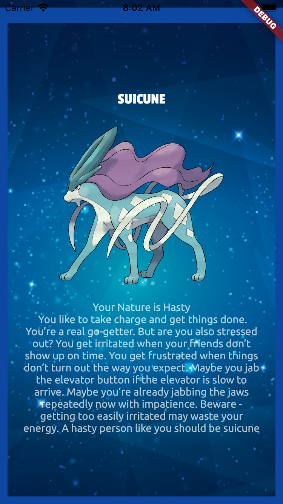
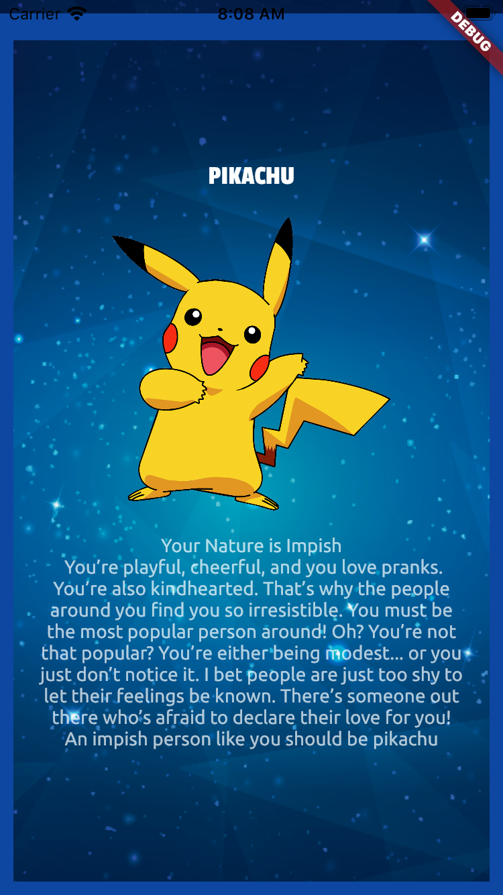
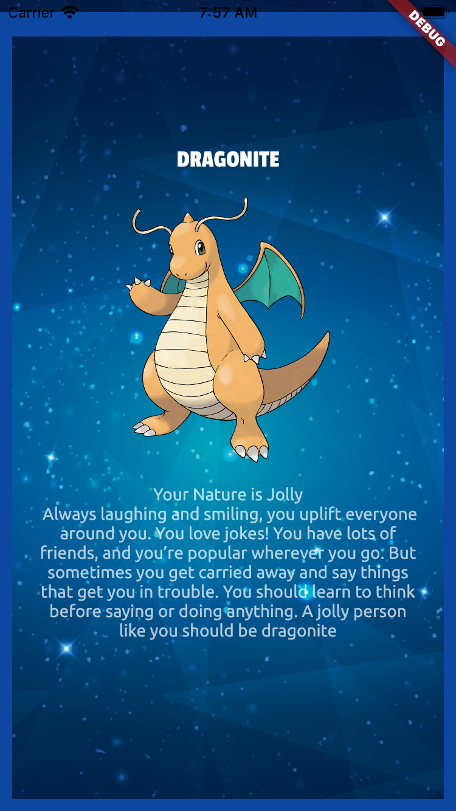
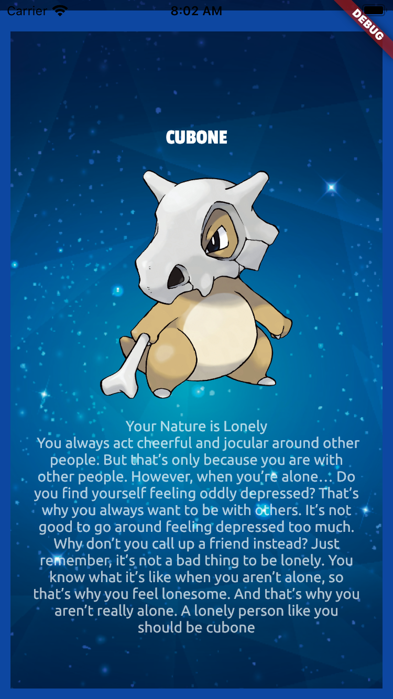
  
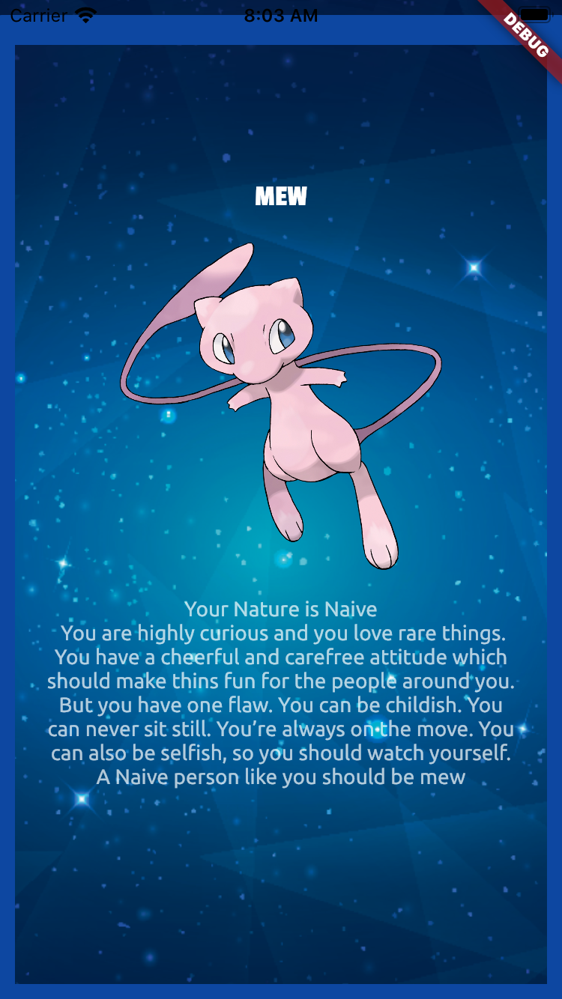
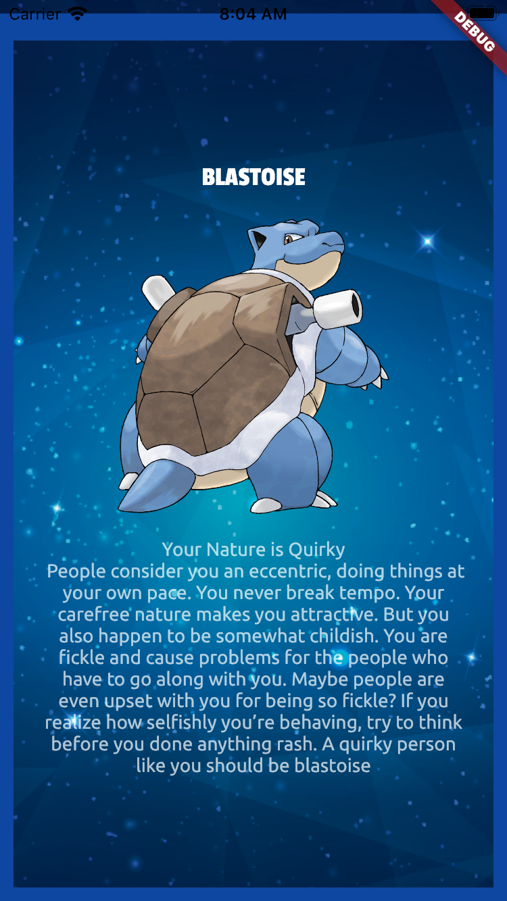
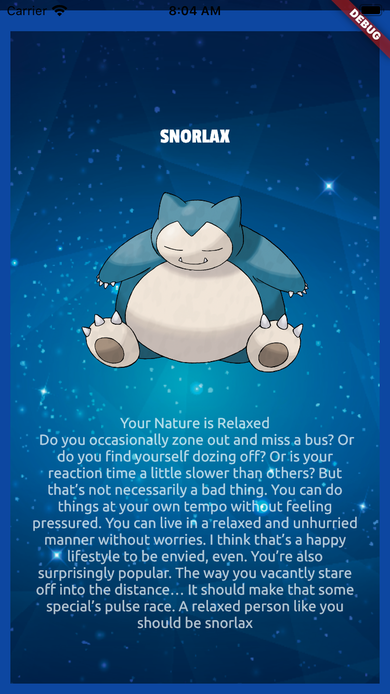
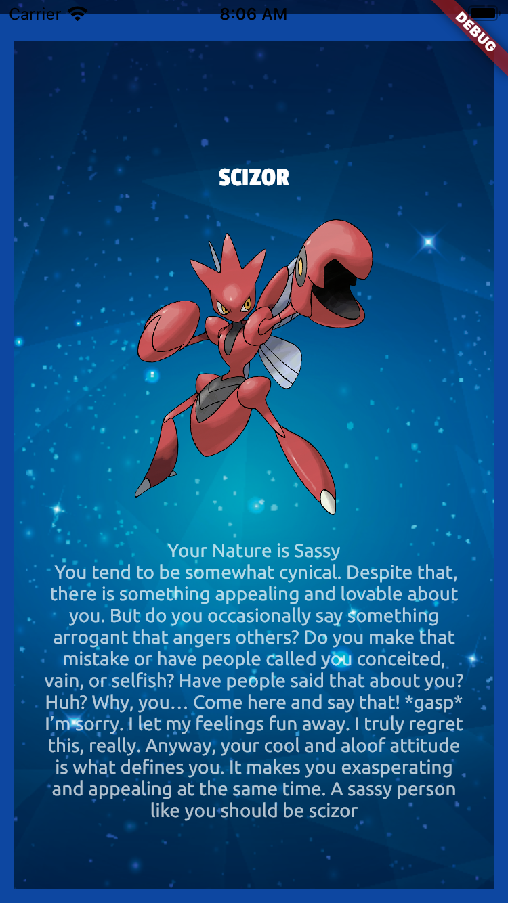
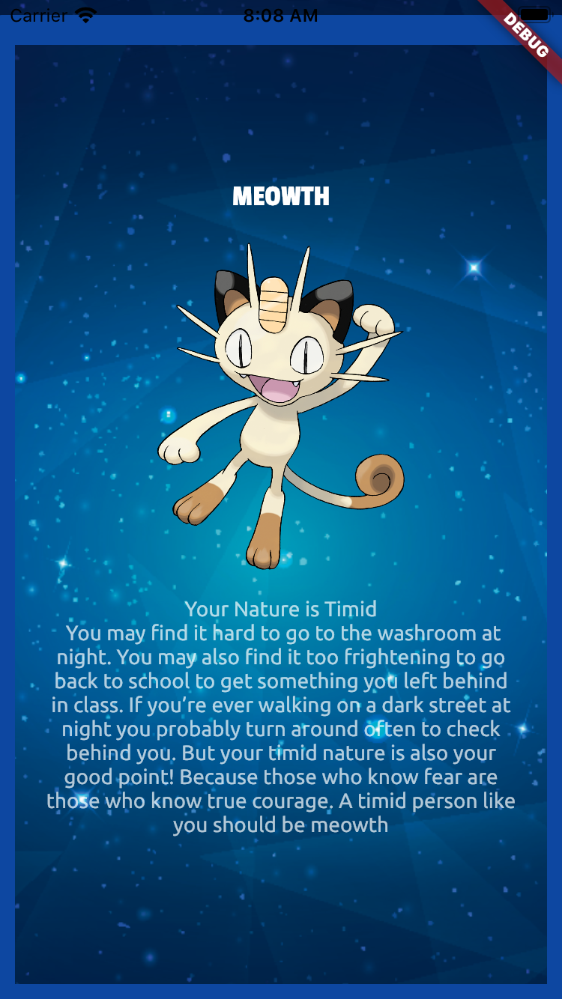

